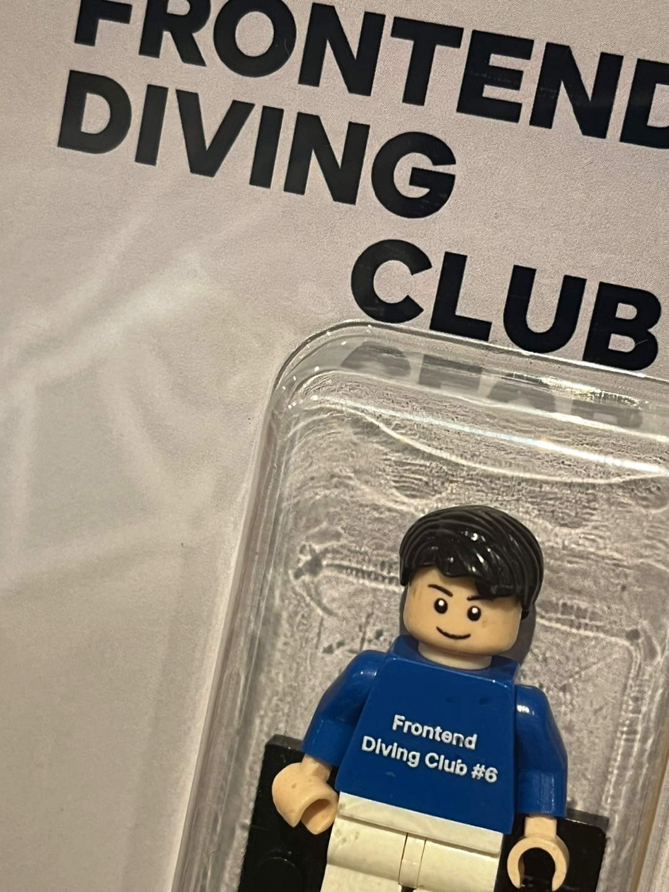

지난 주말, **프론트엔드 다이빙 클럽**에 참가하여 즐거운 시간을 보내고 왔습니다. 이전에 운이 좋게 [SLASH24](https://toss.im/slash-24)에 참가했을 때 발표를 너무 인상 깊게 봤던 터라, 이번 커뮤니티에는 많은 기대를 안고 참여했습니다.

<Callout type="info">
  <strong>프론트엔드 다이빙 클럽(FDC)</strong>은 토스에서 진행하는 오프라인
  모임으로 매 모임마다 정해진 주제로 발표가 진행되고 이와 관련된 이야기를 나누는
  커뮤니티입니다. 자세한 내용은 [토스 블로그](https://toss.tech/article/22217)를
  참고해주세요.
</Callout>

당일 정시에 맞춰 입장했는데, 많은 분이 이미 일찍 도착하여 기다리고 계셨습니다. 만약 다음에 모임을 참가하신다면, 조금 일찍 도착한 경우 미리 올라가 계셔도 좋을 것 같습니다. 입장하고 나서 굿즈로 레고와 스티커, 간단한 식사를 제공받아 자리에 앉았습니다. 참고로 식사는 크라이치즈버거였습니다.

앉자마자 한 분이 프리토킹을 주도해주셨는데, 나중에 알고 보니 토스 직원분들이 **퍼실리테이터**로 앉아서 함께 참여해주셨던 것이었습니다. 이런 모임을 가지면 대체로 다들 대화에 나서지 않는 경우가 있어서 초반 분위기를 만들어주고 진행을 주도해주시는 분이 있으면 좋은데, 퍼실리테이터분들이 그 역할을 아주 잘해주셔서 원활한 의견 공유를 진행할 수 있었던 것 같습니다.

프리토킹 이후 간단하게 모임에 대해 설명해주시고 바로 첫 번째 발표를 진행했습니다.

## 복잡한 폼을 다루는 기술: Multi-Step Form부터 대규모 입력 관리까지

해당 발표는 복잡한 여러 단계의 Multi-Step Form을 중앙집권화된 형태의 관리 방식이 아닌 **개별적인 자율 권한 위임의 형태**로 관리하는 방식에 대한 내용이었습니다.

즉, 각각의 <strong>단계(Step)</strong>가 전체 **Form Value**에 기반하여 필요한 작업(업데이트, 평가 등)을 **독립적으로 정의**하는 구조입니다. 기존에는 Top-Down 방식으로 관리되던 구조를 **Bottom-Up** 방식으로 전환함으로써, **최상단에서의 Form Value 관리 부담을 분산**시키는 것이 인상적이었습니다.

제가 속해있는 조는 해당 주제를 기반으로 각각의 **Multi-Step Form 관리 경험**, **전역 상태 관리**, 그리고 **라이브러리 도입** 등에 대해 다양한 논의를 진행했습니다. 다양한 분들이 모이다 보니 각 조직의 성격과 개발 환경도 저마다 달랐고, 이에 따라 다양한 의견이 오갔습니다.

## 바닥부터 직접 설계하는 그리드 레이아웃 UI

앞전에 SLASH24에서 [굉장히 인상 깊었던 발표](https://www.youtube.com/watch?v=SVt1-Opp3Wo)를 진행하셨던 건영님의 발표였습니다. 당시 발표에서도 논리적인 사고 흐름과 탄탄한 지식 기반이 잘 드러나, 정말 대단한 분이라는 생각이 들었습니다.

이번 발표에서도 흥미로운 발상으로 솔루션을 도출한 경험을 공유해 주셨습니다. 요약하자면, **리사이징**과 **위치 커스텀**이 가능한 **위젯**들을 **그리드 개념**으로 해석하고, 이를 **이진 트리** 형태로 구성하는 방식에 대한 내용이었습니다.

발표가 끝난 후 비교적 긴 질의응답 시간이 이어졌는데, 대부분의 질문이 <strong>"어떻게 그런 사고 흐름을 가질 수 있는지"</strong>에 대한 것이었습니다. 많은 분들이 경외로운 시선으로 바라봤고, 저 역시 그중 하나였습니다. 덕분에 재미있는 경험을 했고, 자극도 많이 받았던 것 같습니다.

발표가 너무 인상적이었기 때문인지, 이후 진행된 논의들은 잘 기억나지 않습니다. 다만, 다른 조에서 발표했던 내용 중 하나는 어렴풋이 떠오르는데, **알고리즘이나 자료구조를 실제 업무에 적용한 경험이 있는지, 그리고 적용한다면 어떻게 하면 좋을지**에 대한 이야기였습니다. 듣고 보니 이런 식의 사고를 평소에 습관화하면 큰 자산이 될 수 있을 것 같다는 생각이 들었습니다.

## 후기

최근 1:1 면접 형식으로 운영되는 스터디에 참여했는데, 프론트엔드 개발자가 많지 않았고 진행 방식도 비대면으로 짧게 이루어져서인지 기대만큼 높은 만족도를 느끼기는 어려웠습니다.

반면, 오늘 커뮤니티에 참여하면서 확실히 같은 프론트엔드 개발자들과 논의하고 발표를 함께 듣는 과정에서 높은 만족도를 느꼈고 다음에도 참여하고 싶다는 생각이 들었습니다.

무엇보다도 이런 좋은 모임을 개최해주신 토스 관계자분들께 감사의 말씀을 전하며, 이만 후기를 마치겠습니다.
