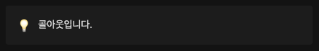
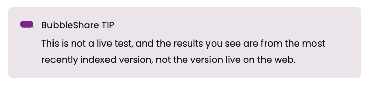
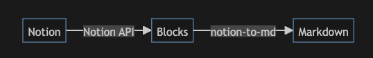
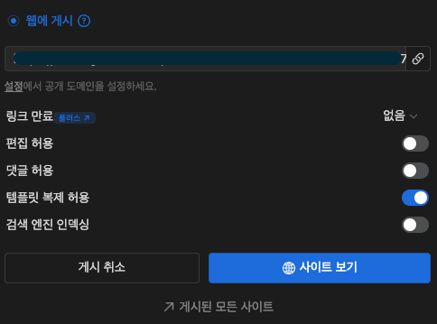

모든 내용은 새로운 프로젝트의 기획으로부터 시작되었습니다. 새로운 프로젝트의 기획은 **작성된 아티클 콘텐츠를 보여줄 수 있는 서비스**를 만드는 것이었고, 이를 해결하기 위해 추가적으로 다음과 같은 내용을 조사했습니다.

- 아티클 콘텐츠는 **주로 Notion을 통해 제작**된다.
- 콘텐츠를 제작하는 구성원들은 **Markdown에 대한 이해가 부족하다.**

풍부한 아티클을 구성하기 위해 텍스트 외에도 이미지 등 다양한 구성 요소가 필요하며, 이를 위해 Markdown 문법으로 작성된 콘텐츠를 정적 페이지로 보여주는 것이 좋다고 생각했습니다.

그래서 Notion API로 전달받은 콘텐츠를 Markdown 형태로 변환해 화면에 보여준다는 구상을 바탕으로 개발을 진행했습니다.

## Notion API 알아보기

공식적으로 Notion에선 Notion Workspace의 데이터를 REST API를 통해 활용할 수 있는 [공개 API](https://developers.notion.com/)를 제공하고 있습니다. 해당 API의 활용 방법은 [공식 문서 가이드](https://developers.notion.com/docs/getting-started)에서 확인하실 수 있습니다.

하지만 Notion API를 활용할 때 고려해야 할 사항이 있었습니다. **API 요청이 초당 3개로 제한**되며, **요청 속도**도 UX에 영향을 줄 정도로 다소 **느리다**는 점입니다.

> The rate limit for incoming requests per integration is an average of three requests per second.

이런 부분은 당장 기능 구현에 큰 문제가 되지 않아, 추후 기능 개선 사항으로 미뤄두고 진행하기로 결정했습니다.

<Callout>
  자세한 내용은 [Request
  limits](https://developers.notion.com/reference/request-limits) 참고해주세요.
</Callout>

Notion 공식 문서에서는 API를 더 쉽게 활용하기 위한 자바스크립트 기반 라이브러리인 [@notionhq/client](https://www.npmjs.com/package/@notionhq/client)를 제시하고 있습니다. Notion 공식 API를 기반으로 제작되었으며 생성한 Auth Token을 할당하기만 하면 쉽게 Notion 데이터를 활용할 수 있도록 구성되어 있습니다.

```ts
const { Client } = require("@notionhq/client");

// 클라이언트 초기화
const notion = new Client({
  auth: process.env.NOTION_TOKEN,
});
```

아래와 같이 콘텐츠를 관리할 데이터베이스를 지정하고, 해당 데이터베이스의 페이지 목록을 가져와 `id` 를 기반으로 각 페이지의 상세 정보를 조회할 수 있습니다.

```ts
// 데이터베이스 목록 불러오기
const pages = await notion.databases.query({
  database_id: databaseId,
});

// 페이지 상세 정보 가져오기
const page = await notion.pages.retrieve({
  page_id: pageId,
});
```

## Notion 데이터를 변환하자

API를 통해 데이터 요청을 진행하고 나니 예상치 못한 부분이 있었습니다. 저희가 일반적으로 알고 있는 Markdown 형식의 구조와 Notion의 데이터 구조는 상이한 부분이 있다는 것입니다.

간략하게 말하면 Notion은 **Block이라는 단위의 객체 형태**의 데이터로 작성된 정보를 구성하고 그래서 Markdown 기반의 콘텐츠 표현 방식보다 더 다양한 방식으로 표현할 수 있습니다. 이는 API 요청으로 전달 받은 데이터에도 동일하게 적용됩니다.


당시 일정이 넉넉하지 않은 상황이었기에 자체적으로 이를 직접 변환하는 방법은 제외하고 다른 방법을 찾기로 결정했습니다.

이를 해결하기 위해 [`notion-to-md`](https://github.com/souvikinator/notion-to-md)라는 오픈 소스를 찾게 되었고, 해당 패키지를 통해 Notion API의 Block 객체를 Markdown 형태로 변환할 수 있었습니다.

사용 방법 또한 너무 간단합니다. 앞의 `@notionhq/client` 를 통해 생성한 클라이언트를 옵션으로 할당하여 `notion-to-md` 의 메서드를 활용할 수 있습니다.

```js
const { Client } = require("@notionhq/client");
const { NotionToMarkdown } = require("notion-to-md");
const fs = require("fs");
// or
// import {NotionToMarkdown} from "notion-to-md";

const notion = new Client({
  auth: "your integration token",
});

// notion client를 옵션으로 전달
const n2m = new NotionToMarkdown({
  notionClient: notion,
  separateChildPage: false, // 하위 페이지 포함 여부 결정
});

(async () => {
  // 페이지 id를 전달하여 Markdown blocks 추출
  const mdblocks = await n2m.pageToMarkdown("target_page_id");
  // 이를 다시 문자열 형태로 변경
  const mdString = n2m.toMarkdownString(mdblocks);
  console.log(mdString.parent);
})();
```

마지막으로 변환된 데이터는 다음과 같은 형태로 확인할 수 있습니다.

```js
{
  "parent": "\n# This is parent page ..."
}
```

### 특정 노션 Block 커스텀

이제 Markdown 형태의 문자열로 변환된 해당 데이터를 활용하여 아티클 콘텐츠를 보여줄 수 있게 되었습니다. 하지만 약간의 문제가 있는데 **Notion의 모든 Block 요소들은 Markdown 형태로 변환될 수 없다**는 점입니다. 예를 들어 Notion의 Callout의 경우 다음의 형태를 갖습니다.



좌측엔 Notion에서 제공하는 아이콘 이미지 혹은 첨부 이미지를 할당할 수 있으며 우측엔 추가적인 콘텐츠를 작성할 수 있는 영역이 존재합니다. Callout 타입은 Markdown 형태로 구현하는데 어려움이 있기에 **이를 별도로 커스텀하는 과정을 추가**해야 합니다.

특정 타입의 Block의 경우 `notion-to-md` 를 통해 커스텀 할 수 있습니다.

```js
const { NotionToMarkdown } = require("notion-to-md");

const n2m = new NotionToMarkdown({ notionClient: notion });

// embed 타입의 block을 커스텀 하여 지정
n2m.setCustomTransformer("embed", async (block) => {
  const { embed } = block as any;
  if (!embed?.url) return "";
  return `<figure>
  <iframe src="${embed?.url}"></iframe>
  <figcaption>${await n2m.blockToMarkdown(embed?.caption)}</figcaption>
</figure>`;
});
```

앞의 예시처럼 `setCustomTransformer` 를 통해 Notion Block을 Markdown 형태로 변환할 때 정한 형태로 변환할 수 있습니다. 이렇게 하면 Markdown 문법으로 구현이 불가능한 요소들도 렌더링 할 수 있습니다.



앞의 과정을 정리하면 다음과 같이 도식화 할 수 있습니다.



추가로 이번 프로젝트에선 스타일링 라이브러리로 [**Tailwindcss**](https://tailwindcss.com/)를 활용했으며 Markdown 렌더링을 위해서 [**`react-markdown`**](https://github.com/remarkjs/react-markdown) 이라는 패키지를 활용했습니다. 앞의 `react-markdown` 을 활용하면 [커스텀 컴포넌트](https://github.com/remarkjs/react-markdown?tab=readme-ov-file#use-custom-components-syntax-highlight) 기능을 통해 Markdown이 렌더링 될 때 스타일이 적용된 상태로 렌더링 될 수 있도록 처리할 수 있습니다.

```tsx
<Markdown
  ...
  components={{
    // customize h1 tag
    h1(props) {
      return <h1 className="text-blue-400" {...props} />;
    },
  }}
/>
```

Markdown 문법으로 표현되는 컴포넌트들은 위와 같이 스타일링 할 수 있었습니다.

## 초기 렌더링 속도 개선하기

앞에서 말씀드린 대로 Notion API 요청 자체가 느려서인지 유난히 페이지 렌더링 속도가 느리다고 느껴졌습니다. **초기 콘텐츠 렌더링이 느린 것은 좋은 UX를 제공하지 못하다고 판단**되어 화면 렌더링 단계까지 마친 이후에 이를 개선하기로 결정했습니다.


기존엔 [서버 컴포넌트(RSC)](https://react.dev/reference/rsc/server-components) 내부에서 직접 데이터를 요청하여 활용하는 방식을 사용했는데, 아티클 콘텐츠의 특성상 변경이 잦지 않다는 점을 감안하여 [Next.js의 정적 사이트 생성(SSG, Static Site Generation) 방식](https://nextjs.org/docs/pages/building-your-application/rendering/static-site-generation)을 활용하면 초기 렌더링 속도를 줄일 수 있을 것이라 판단하고 이를 적용하기로 결정했습니다.

정적 사이트 생성은 Next.js 13 버전부터 `generateStaticParams` 함수를 통해 가능한데, 해당 함수 내부에서 API 요청을 통해 데이터를 가져오는 방식과 프로젝트에 Markdown 파일을 저장하여 관리하는 방식으로 이를 구현할 수 있습니다.

두 방식 **모두 초기 렌더링 시간이 빠르다**라는 공통점이 있지만 차이점은 **빌드 시간**과 **네트워크 의존성**입니다. API 요청을 통해 정적 경로를 생성하는 경우, 빌드 타임에서 API 요청을 실행하기에 네트워크 지연과 API 응답 시간이 추가되어 빌드 시간이 증가하며 네트워크 연결에 문제가 생기면 정상적인 빌드가 진행되지 않습니다.

또한 매 빌드마다 아티클을 Notion으로 부터 최신화 하기 때문에 아티클 업데이트 주기를 맘대로 하지 못할 수 있어 이를 제어하고자 **프로젝트에 Markdown 파일을 저장하는 방식**을 선택하게 되었습니다.

이를 위해 Notion API를 활용하여 **프로젝트에 Notion 페이지들을 Markdown 형태로 다운로드 하는 스크립트**를 작성하기로 했습니다.

```js fetch-md.mjs
import fs from "fs";
import { join } from "path";

import { Client } from "@notionhq/client";
import { clsx } from "clsx";
import dotenv from "dotenv";
import { NotionToMarkdown } from "notion-to-md";
import { twMerge } from "tailwind-merge";

// 환경변수 사용을 위한 설정
dotenv.config();

export const notion = new Client({
  auth: process.env.NOTION_AUTH_SECRET,
});

const n2m = new NotionToMarkdown({
  notionClient: notion,
  config: {
    separateChildPage: true,
  },
});

// customize markdown

n2m.setCustomTransformer("callout", async (block) => {
  // callout custom ...
});

// 아티클 목록 요청
const getArticleDB = async () => {
  const db = await notion.databases.query({
    database_id: process.env.NOTION_CONTENT_DATABASE_ID,
  });

  const articleDB = db.results;

  return articleDB;
};

// 아티클 메타데이터 요청
const getArticleMetadataDB = async (pageId) => {
  const db = await notion.pages.retrieve({ page_id: pageId });

  const articleDB = db;

  return articleDB;
};

// 아티클 ID 목록 반환
export const getArticleIds = async () => {
  const articleDB = await getArticleDB();

  const articleIds = articleDB.map(({ id }) => id);

  return articleIds;
};

// 아티클 상세 데이터 파싱하여 반환
export const getArticleDetail = async (pageId) => {
  const metadataDB = await getArticleMetadataDB(pageId);

  const mdblocks = await n2m.pageToMarkdown(pageId);
  const mdString = n2m.toMarkdownString(mdblocks);

  return {
    metadata: parseArticleMetadataString(metadataDB),
    markdown: mdString.parent,
  };
};

// Markdown 파일 생성
const writeArticleMarkdown = (title, markdownString) => {
  let error;
  const path = join(process.cwd(), "아티클 경로");

  fs.writeFile(path, markdownString, (err) => {
    if (err) {
      error = err;
    }
  });

  return error;
};

// 스크립트 본 실행 함수
(async () => {
  try {
    let errors = [];

    const articleIds = await getArticleIds();
    const articles = await Promise.all(
      articleIds.map(async (id) => await getArticleDetail(id)),
    );

    articles.forEach(({ metadata, markdown }) => {
      const metadataString = `---
... 메타데이터 ...
---`;

      const error = writeArticleMarkdown(
        metadata.title.toLowerCase().replace(/ /g, "-"),
        metadataString + markdown,
      );

      if (error) {
        errors.push(error);
      }
    });

    console.log(`아티클 다운로드가 완료되었습니다 📃
성공: ${articles.length - errors.length} / 실패: ${errors.length}
    ${
      errors.length > 0
        ? `
오류 내용
${errors.reduce((acc, cur) => acc + cur, "")}`
        : ""
    }
    `);
  } catch (error) {
    console.error("마크다운을 불러오는 도중 오류가 발생했습니다:", error);
  }
})();
```

기존에 Notion API를 활용하여 요청하는 코드와 차이점은 크게 없습니다. 추가된 내용은 로컬 환경변수 활용을 위한 `dotenv` 설정과 Markdown 파일을 생성하기 위한 `writeArticleMarkdown` 함수가 추가되었습니다.

마지막으로 스크립트 실행을 위한 명령어를 `package.json`에 정의했습니다.

```json package.json
{
  "scripts": {
    "download-notion": "rm -rf [아티클 폴더 경로] && mkdir [아티클 폴더 경로] && node fetch-md.mjs"
  }
}
```

이렇게 변경하고 나서 렌더링 시간이 **약 3초 가량 줄어** 체감상 빨라진 느낌이 확 들었습니다.

<Video src="before-download.mov" />

반영 전에는 위와 같이 딜레이가 길게 느껴집니다.

<Video src="after-download.mov" />

이전보다 확실히 딜레이가 확 줄어든 느낌을 받게 됩니다. 더욱 자세히 보여주기 위해 클릭 모션도 화면에 반영했어야 했는데 없으니 클릭 타이밍이 보이지 않아 애매한 부분이 있긴 하네요.

## Notion 이미지 URL 만료 문제

하지만 Markdown 파일을 프로젝트 내에 다운로드 받는 형식으로 변경하면서 몇 가지 문제가 발생했습니다. Markdown으로 변환하면서 기존엔 문제가 되지 않았던 부분 중 하나는 **이미지 URL 만료 문제**였습니다.

Notion 이미지는 AWS S3에 저장되게 되는데 해당 이미지를 불러오는 URL은 **시간 제한**이 있어 Markdown 형태에 해당 형태의 이미지 URL이 저장되게 되면 일정 시간 이후엔 이미지를 확인할 수 없다는 문제가 발생한 것입니다.

이를 해결하기 위해 **공유된 웹사이트 내 이미지 주소 형태로 변환하여 사용**하기로 했습니다. Notion의 경우 **웹에 개시**를 할 수 있는 기능이 있는데 해당 기능을 사용하면 설정된 도메인으로 공개된 형태의 페이지에 진입 가능하게 되고 해당 페이지에서 이미지는 다른 형태의 URL로 변경되어 있는 것을 확인할 수 있습니다.

위 내용을 바탕으로 **기존 이미지 URL의 필수 파라미터만 추출하여 공개 페이지 이미지 경로로 변환**하는 함수를 작성하였습니다.

```js
// 웹에 개시된 이미지 URL로 전환
const transferImgSrc = (orgSrc, blockId) => {
  const orgUrl = new URL(orgSrc);
  const orgUrlBase = encodeURIComponent(
    orgUrl.protocol + "//" + orgUrl.host + orgUrl.pathname,
  );

  const validUrl = new URL(
    process.env.NOTION_PUBLISHED_DOMAIN + `/image/${orgUrlBase}`,
  );
  const validUrlSearchParams = validUrl.searchParams;

  const essentialParams = [
    {
      key: "id",
      value: blockId,
    },
    {
      key: "table",
      value: "block",
    },
  ];

  essentialParams.forEach(({ key, value }) => {
    validUrlSearchParams.set(key, value);
  });

  return validUrl.href;
};
```

해당 함수를 `setCustomTransformer` 를 통해 `"image"` 타입의 Block을 커스텀하여 Markdown 다운로드 결과엔 이미지 경로가 공개 페이지 이미지 경로를 따라가도록 만들었습니다.

웹에 게시를 했을 때 해당 페이지가 검색 결과에 공개되면 문제가 되었겠지만 **검색 엔진에 인덱싱 되지 않도록 선택할 수 있는 옵션**이 존재했기 때문에 이미지 경로 만을 위해 활용할 수 있었습니다.



### Markdown 렌더링 중 스타일 미적용 문제

정확히 말하자면 해당 이슈는 Markdown 다운로드 방식이 만든 이슈는 아니지만 형식을 다운로드 형태로 바꾸는 과정에서 인지하지 못해 발생한 문제였습니다. 앞에서 말씀드린 대로 이번 프로젝트에선 Tailwindcss를 활용했는데 이에 대한 기본 설정 사항을 `tailwind.config.js` 파일에서 관리할 수 있습니다.

해당 설정 옵션 중 `content` 필드는 클래스 이름을 감지하여 해당하는 CSS를 모두 생성할 수 있도록 감지할 파일의 유형을 [**glob 패턴**](<https://en.wikipedia.org/wiki/Glob_(programming)>)으로 작성할 수 있습니다. 이 말은 곧 해당 **`content` 필드에 일치하지 않는 파일에 포함된 클래스 이름의 CSS는 생성되지 않을 수 있다**는 것을 의미합니다.

그리고 Markdown 형태로 다운로드 받게 되면서 커스텀 Block에 포함된 스타일들이 누락되었고 이를 해결하기 위해선 `content` 영역에 이를 포함시켜야만 했습니다. 이를 위해 다운로드 스크립트 구문이 포함된 파일을 `content` 필드에 추가시켰습니다.

<Callout type="info">
  아티클 경로에 해당하는 Markdown 확장자 형태를 glob 패턴으로 작성해도 되지만,
  커스텀 외에 Tailwindcss 스타일링이 반영될 부분이 없기도 했고 보다 구체적인
  스크립트 파일을 지정하는 것을 선택했습니다. 자세한 내용은 [Tailwindcss :
  Content Configuration](https://tailwindcss.com/docs/content-configuration)를
  참고해주세요.
</Callout>

```js tailwindcss.config.mjs
/** @type {import('tailwindcss').Config} */
module.exports = {
  content: [
    './fetch-md.mjs',
    ...
  ],
  // ...
}
```

이후 정상적으로 스타일링이 반영된 모습을 확인할 수 있었습니다.

## 결론

이번 프로젝트를 진행하면서 Notion API로 어떤 기능까지 확인할 수 있고 어떤 한계점이 있는지 확인할 수 있었습니다. 개인적으로 Notion이 제공하는 Editing UI는 그 어떤 인터페이스 보다 유용한 형태를 갖추었다는 생각을 합니다.

물론 이건 이미 Notion 인터페이스에 익숙해진 사람의 말이라 애매하기도 하고 실제로 주변에 아직은 Notion이 어렵다는 분들도 심심치 않게 볼 수 있는 걸 보면 마냥 보편적으로 편한 형태이진 않다는 생각이 들기도 합니다. 아무래도 Markdown을 기본적으로 지원하다 보니 개발자인 저에게 익숙하게 느껴진 것도 한 몫하는 것 같습니다.

그렇지만 기존 Markdown이나 CMS와 다르게 표현할 수 있는 UI 요소들이 많고 여러 플랫폼을 연동하여 활용할 수 있는 기능이 많다는 점은 보다 더 효과적으로 정보를 보여줄 수 있다는 점에서 확실한 이점이 있는 것 같습니다.

저와 같이 이미 Notion 편집 방식에 익숙함을 느끼는 구성원들과 함께 일하는 와중에 해당 Notion을 활용하여 프로덕션 단에 추가해야 할 기능이 있으시다면 위 방법을 적용해보셔도 좋을 것 같습니다.

## 참고

- [화해 블로그 : Notion API와 함께 정적 페이지로의 여정](https://blog.hwahae.co.kr/all/tech/10960)
- [Ethan : 노션에 첨부된 이미지 URL 만료 없이 사용하기](https://weezip.treefeely.com/post/weezip-use-not)
